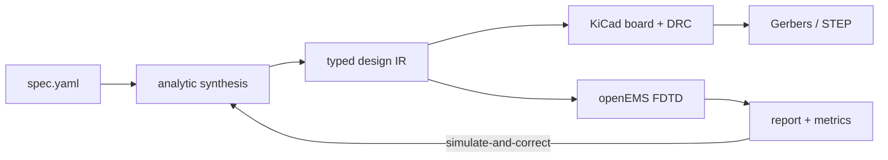

# antenna-cad

[](https://pypi.org/project/antenna-cad/)
[](https://pypi.org/project/antenna-cad/)
[](https://github.com/jman4162/antenna-cad/actions/workflows/ci.yml)
[](https://github.com/jman4162/antenna-cad/blob/main/LICENSE)
[](https://github.com/astral-sh/ruff)
[](https://github.com/astral-sh/uv)
[](https://mypy-lang.org/)

Compile antenna and phased-array design intent into simulation-ready KiCad PCB layouts.

antenna-cad is a Python design compiler for printed antennas. You describe requirements
(frequency, substrate, polarization, gain); it synthesizes geometry, writes a
DRC-checkable `.kicad_pcb`, simulates the layout with openEMS, and reports predicted
performance against the requirements. Every step is deterministic and runs headlessly,
with no KiCad GUI and no LLM in the loop. Agents can drive the same typed API, but
nothing depends on one.

<p align="center">
  
</p>
<p align="center"><em>A 4×4 corporate-fed patch array at 10 GHz: synthesized, routed, DRC-checked, and
full-wave simulated from a 15-line spec file. No human drew any copper.</em></p>

## From spec to verified board

```yaml
design:
  name: array_2x2_10ghz
requirements:
  center_frequency: 10 GHz
  impedance: 50 ohm
  substrate: RO4350B
  substrate_height: 0.508 mm
element:
  type: rectangular_patch
array:
  nx: 2
  ny: 2
  spacing: 0.6 lambda
```

```bash
pip install antenna-cad
antenna-cad report spec.yaml -o build/ --tune
```

That one command synthesizes the patches and the corporate feed (quarter-wave
transformers, phase-compensated mirrored rows), emits a KiCad board, runs real KiCad
DRC, simulates the exact layout in openEMS FDTD, iterates a simulate-and-correct
tuning loop, and writes a verification report:

| Board (KiCad render) | Return loss | Radiation pattern |
|:---:|:---:|:---:|
|  |  |  |

Measured for this 2×2 (openEMS, tuned): resonance 10.12 GHz against the 10 GHz
target, S11 −14.8 dB, directivity 12.8 dBi, gain 11.7 dBi, single broadside beam.



## Verified examples

| Example | Result (openEMS) | |
|---|---|---|
| [Single patch, 10 GHz](https://github.com/jman4162/antenna-cad/tree/main/examples/patch_10ghz) | f_res 9.84 GHz, S11 −11.5 dB, D 6.8 dBi |  |
| [2×2 corporate-fed array](https://github.com/jman4162/antenna-cad/tree/main/examples/array_2x2_10ghz) | tuned: f_res 10.12 GHz, S11 −14.8 dB, D 12.8 dBi, gain 11.7 dBi |  |
| [4×4 corporate-fed array](https://github.com/jman4162/antenna-cad/tree/main/examples/array_4x4_10ghz) | D 16.8 dBi, gain 15.4 dBi, −13 dB E-plane sidelobes; match limited to −8 dB ([why](https://github.com/jman4162/antenna-cad/tree/main/examples/array_4x4_10ghz)) |  |

Every number above is a real openEMS result from the committed example specs; the
figures rebuild from checked-in run data with `uv run python figures/make_figures.py`.

## Design principles

- **Compiler, not file generator.** The source of truth is a typed internal
  representation of the design — geometry, stackup, nets, ports, constraints, units.
  KiCad, Gerber, and solver files are build artifacts compiled from it.
- **Deterministic core.** The same spec produces the same board, byte for byte.
  Verification runs through real engines: KiCad DRC (`kicad-cli`) and full-wave FDTD
  (openEMS).
- **Physical quantities carry units** (via pint). `10 GHz` and `8.42 mm` are values in
  the API; bare floats cross into backends only at explicit conversion boundaries.
- **Narrow scope by design.** This targets the structures printed antennas need
  (patches, microstrip lines, impedance transformers, feed trees, ground pours, via
  fences) rather than general PCB autorouting or schematic capture.

## Install

```bash
pip install antenna-cad            # core: synthesis, IR, KiCad emission
pip install "antenna-cad[pam]"     # + phased-array-modeling lattice interop
pip install "antenna-cad[mcp]"     # + MCP server for agents
pip install "antenna-cad[dxf]"     # + DXF export
```

KiCad 8+ provides DRC, rendering, and manufacturing export (`brew install --cask
kicad` on macOS; distribution package `kicad` on Linux). openEMS runs natively where
its Python bindings are installed, or reproducibly in Docker:

```bash
docker build -t antenna-cad-openems docker/
```

## For agents (MCP)

The same pipeline is exposed as typed MCP tools — synthesize, layout, DRC, simulate,
report, export — so an agent can iterate designs against real DRC and full-wave
feedback instead of hallucinating copper:

```bash
pip install "antenna-cad[mcp]"
antenna-cad mcp serve
```

```json
{
  "mcpServers": {
    "antenna-cad": {"command": "antenna-cad", "args": ["mcp", "serve"]}
  }
}
```

## Citing

If antenna-cad contributes to academic work, please cite it (GitHub's "Cite this
repository" button uses [CITATION.cff](https://github.com/jman4162/antenna-cad/blob/main/CITATION.cff);
an archival DOI is planned):

```bibtex
@software{hodge2026antennacad,
  author  = {Hodge, John},
  title   = {antenna-cad: a design compiler for antenna and phased-array {PCBs}},
  year    = {2026},
  version = {0.1.1},
  url     = {https://github.com/jman4162/antenna-cad},
  license = {MIT}
}
```

## License

MIT
